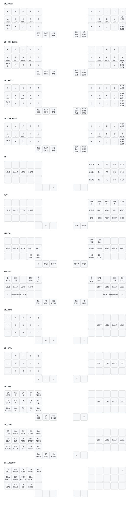

# Charybdis Nano (3x5)

Split 3x5+3 with a trackball on the right half, Splinky (RP2040) controller.

```sh
just build charybdis
```

## Layout



Regenerate with `just draw`. Layer grids live in `layers/`, one file per host
layout; `keymap.c` only assembles them. Shared behavior and the host layout
system are documented in [users/riad](../../../../../../users/riad/README.md).

Home-row mods on `ASDF` / `JKL'`. Hold a key for its layer:

| Hold | Layer |
| --- | --- |
| `ESC` | media, `QK_BOOT`, `EE_CLR`, host layout keys |
| `SPC` | navigation |
| `TAB` | F1–F12 |
| `ENT` | symbols |
| `BSPC` | digits |
| `Z` or `/` | trackball: DPI, sniping, drag-scroll, buttons |
| `P` (CA only) | French accents |

## Host layout

The firmware boots in US. `ESC` + `Y` sets US, `ESC` + `U` sets CA; the choice
is absolute, persisted, and printed over `qmk console`.

The OS must match. Hyprland, pinned per device:

```ini
device {
    name = bastard-keyboards-charybdis-nano-(3x5)
    kb_layout = ca
    kb_variant = multix
}
```

If the two sides disagree, letters still work but symbols are wrong.

### Following the OS

To have an OS-side switch (for example Alt+Shift) carry the firmware along:

```ini
input {
    kb_layout = us,ca
    kb_variant = ,multix
    kb_options = grp:alt_shift_toggle
}
exec-once = <this repo>/scripts/host-layout watch
```

`watch` listens to Hyprland's layout events for this keyboard and calls the
firmware's set command, so both sides always agree. `ESC` + `Y`/`U` remain as
a firmware-only override.

Caveat: home row holds Alt on `S` and Shift on `F`, so an Alt+Shift chord
built from home-row mods (for example Alt+Shift+arrow) also fires the OS
toggle.

### Widget

`scripts/host-layout` queries the firmware over raw HID and prints the active
layout. Waybar:

```jsonc
"custom/kb-layout": {
    "exec": "<this repo>/scripts/host-layout",
    "interval": 5,
    "format": "⌨ {}"
},
```

## Flashing

Both halves take the same image. Do them one at a time, each plugged into USB.

1. **Hold `ESC`, press `B`**, or tap reset twice, to mount as `RPI-RP2`.
2. Copy `build/bastardkb_charybdis_3x5_elitec_riad.uf2` onto it.
3. Repeat for the other half.
4. Plug USB into the **right** half, the one with the trackball.

If the drive doesn't auto-mount, `udisksctl mount -b /dev/sdX1`. Verify
`LABEL=RPI-RP2` and `MODEL=RP2` first. Writing to the wrong device is bad.

Only the master half needs reflashing for a keymap change. Reflash both when
changing something structural like `MASTER_RIGHT`.

## Board notes

**The target has no "Splinky" in it.** QMK's 2025-08-31 restructure removed
`bastardkb/charybdis/3x5/v2/splinky_3`. The Splinky is an RP2040 Community
Edition board in an Elite-C footprint, so it builds as
`bastardkb/charybdis/3x5/elitec` with `CONVERT_TO = rp2040_ce`.

**`MASTER_RIGHT` is required.** Mainline sets no handedness, so whichever half
has USB is assumed to be the left one; without it the layout mirrors.

**RGB Matrix is disabled**; this unit has no per-key LEDs.

**The `UPDATE` button on the PCB is not `BOOTSEL`.** Holding it through
power-on does not enter the bootloader.

## Recovery

**Layout mirrored after flashing:** press `EE_CLR` (`ESC` + `V`). Stale
handedness can persist in EEPROM and override `MASTER_RIGHT`.

**A half is stuck on firmware where `ESC` + `B` is unreachable:** plug that
half in alone and **hold `Z`, tap `Q`**. Its matrix is read as the opposite
hand, which lands on a key bound to `QK_BOOT`.
